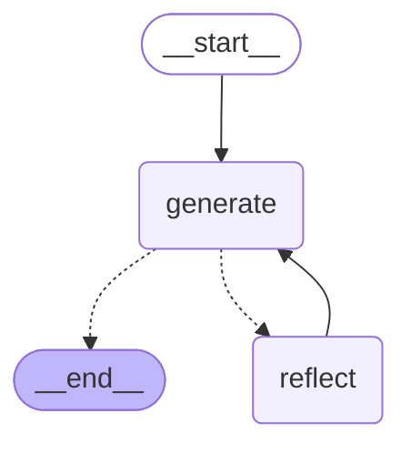

---
config:
  flowchart:
    curve: linear
---

          +-----------+
          | __start__ |
          +-----------+
                *
                *
                *
          +----------+
          | generate |
          +----------+
          ...        ***
         .              *
       ..                **
+---------+           +---------+
| __end__ |           | reflect |
+---------+           +---------+